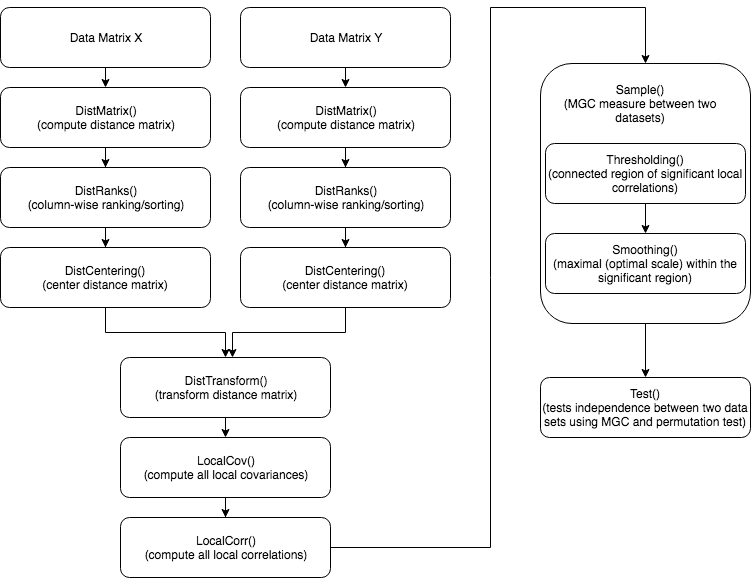

# mgcpy

[](https://coveralls.io/github/NeuroDataDesign/mgcpy?branch=master)
[](https://travis-ci.com/NeuroDataDesign/mgcpy)
[](https://www.python.org/dev/peps/pep-0008/)
[](https://opensource.org/licenses/Apache-2.0)

<<<<<<< HEAD
"mgcpy" is a Python package containing tools for multiscale graph correlation and other statistical tests, that is capable of dealing with high dimensional and multivariate data. 

It contains statistical tests including dHSIC, DCORR, HHG, RVCorr, MDMR, and MGC.
=======
`mgcpy` is a Python package containing tools for multiscale graph correlation and other statistical tests, that is capable of dealing with high dimensional and multivariate data.
>>>>>>> 63454719ad124bd1896cc779da95cef7ba8923f8

## Installation Guide:

### Install from PyPi
```
pip3 install mgcpy
```

### Install from Github
```
git clone https://github.com/NeuroDataDesign/mgcpy
cd mgcpy
python3 setup.py install
```
- `sudo`, if required
- `python3 setup.py build_ext --inplace  # for cython`, if you want to test in-place, first execute this

## MGC Algorithm's Flow


## License

This project is covered under the **Apache 2.0 License**.
